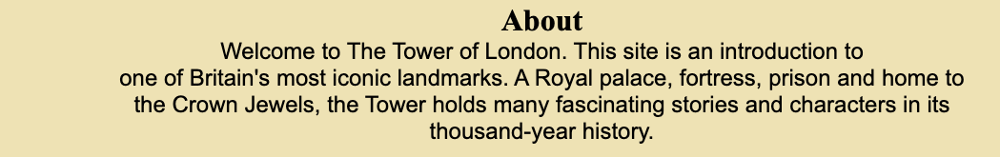

<h1>The Tower of London</h1>

 

The Tower of London website is an introduction to one of Britain's most famous landmarks and is designed to be a starting point for people to learn a little of its history and background. 

Users of this website will be able to sample some highlights of history with links to more in-depth sources. They can also view some images of the Tower, and sign up to a newsletter.

<h1>Features</h1>

<h2>Navigation</h2>
At the top of the page is the navigation bar, which shows the website logo, THE TOWER OF LONDON. To the right are four navigation links: About, History, Gallery and Mailing List, which link

to different sections of the main page.

The navigation is in a simple Times New Roman for easy viewing, and it's also a traditional look which matches with a structure as old as the Tower.

The navigation is simple to use and makes it clear what they are about.

 
<h2>The About Section</h2>

The About section introduces the viewer to the website, explaining that it's a starting point for learning about the rich history and characters. It's placed right above the Timeline section, 
so readers can immediately dive into the stories. I gave it a background spanning the width of the site so it was marked out as it's own section, to help seperate it from the rest of the site.

 
<h2>The Timeline</h2>

The timeline covers some highlights of historical events at the Tower, from its construction in the 11th century, all the way up to the 1950's. Most have an external link to Wikipedia
or other websites, since the scope of information on the Tower's history is too large for my site to cover. But it provides more information should the reader wish to have some in-depth knowledge.

 

<h2>The Gallery</h2>

The gallery shows some images taken by myself in the Tower of London. These are designed to compliment the information in the timeline, and add some decoration to the site. I made sure the links were accessible by providing an aria label for each one - including the hero image.

 

<h2>The Mailing List Form</h2>

The Mailing List form encourages users to sign up to a newsletter. It has input sections for first name, last name and email address. Each of these is required and a pop up appears if the user
 tries to submit the form without one of these inputs. I gave the form the same background colour as the About section, to break up the page and keep the colours consistent.

  

 <h1>Testing</h1>

 I used devtools device toolbar to confirm it is responsive on different screen sizes, and also used Responsive Design Checker.com to see how it looked on smaller devices.

 
I tested each of the links in the nav bar to make sure they linked to the correct sections.

 
I checked each external link linked to the correct page and that no links were broken.

 
I confirmed that the form works, that only first name will go in the first name box, last name in the last name box, and email address in the email box. 
 I confirmed pressing 'Submit' results in a pop up to confirm these fields need filling in, and it won't let you submit without them.

 
 <h2>Bugs</h2>

No known bugs have been found.

 

<h2>Validator Testing</h2>

<strong>HTML</strong> - Unfortunately, the <a href="https://validator.w3.org/nu/?doc=https%3A%2F%2Fjoannalsk.github.io%2FThe-Tower-of-London%2F">W3C Validator</a> detected 24 errors and 14 warnings. 

I tried to correct some of these errors, but it resulted in my site losing its structure. Given the lack of time before the deadline, 
I felt it best not to make these changes, as it may have resulted in me unable to correct them and handing in a site with everything out of place. Other issues brought up included the forward-slash-a tags, which were marked as stray end tags. I will try to fix these errors for resubmission.

 
<strong>CSS</strong> - No errors were found when it was checked with the W3C Validator.

 
<strong>Accessibility</strong>

I made sure the page was easy to read and navigate by running it through Lighthouse on devtools, for both mobile and desktop.

Desktop stats

<

Mobile stats

<h1>Deployment</h1>

The site was deployed to Github pages. To get to the page, go to the Github repositry, and head for the Settings tab. Click 'Pages' on the left-hand column, and 
it will take you to the live website address. 

The live link can be found here -  <a href="https://joannalsk.github.io/The-Tower-of-London/">The Tower of London.</a>

 
<h1>Credits</h1>

The hero image was taken from  <a href="https://upload.wikimedia.org/wikipedia/commons/5/5d/Tower_of_London_-_01.jpg ">Wikipedia</a>
All other images were taken by me.

Thanks to Harry Dhillon and Chris Quinn for stepping in for mentor sessions at the start. Thanks to my mentor, Rahul Lakhanpal for helping me create a good looking site and 
picking up on where I needed to go. Thanks to the Slack community for answering lots of questions.

 Responsive Design Checker.com for testing the responsive design on different screen sizes. 
 
 
w3schools.com for help with the gallery CSS. 

 
Information on the Tower was taken from <a href="https://en.wikipedia.org/wiki/Tower_of_London">Wikipedia.</a> and my own knowledge.
 
 
Further info on the Princes in the Tower taken from <a href="https://www.theguardian.com/science/2013/feb/05/princes-in-tower-staying-under"> The Guardian </a>

I used the Love Running signup form challenge for the basis of my Mailing List form.

